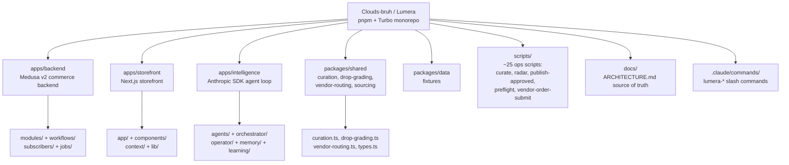

# Beexly / Clouds-bruh

**AI wiki overview**

**Lumera — The Broadcast**: "a living, intelligent marketplace: every category, broadcast in real time and personalized to you. Self-improving, agent-run." A TypeScript monorepo (pnpm workspaces + Turbo, `pnpm-workspace.yaml`, `turbo.json`, `docker-compose.yml`).

- `apps/backend/` — Medusa v2 commerce backend (`medusa-config.ts`). `src/` has `api/` (endpoints), `modules/` (domain modules), `workflows/` (Medusa workflows), `subscribers/` (event subscribers), `jobs/` (scheduled jobs), `lib/` (shared utilities).
- `apps/storefront/` — Next.js storefront (`next.config.ts`, `tailwind.config.ts`, `middleware.ts`, `vitest.config.ts`). `src/` has `app/` (App Router pages), `components/`, `context/`, `lib/`.
- `apps/intelligence/` — custom AI agent layer (Anthropic SDK tool-use loop per README). `src/` has `agents/`, `orchestrator/`, `operator/`, `memory/`, `learning/`, `tools/`, `vendors/`, plus `introspection.ts`, `mcp.config.ts`.
- `packages/shared/` — shared domain logic: `curation.ts`, `drop-grading.ts`, `vendor-routing.ts`, `sourcing.ts`, `events.ts`, `channels.ts`, `constellation.ts`, `types.ts` (each with matching `.test.ts` files).
- `packages/data/` — data layer (`README.md`, `fixtures/`).
- `scripts/` — ~25 operational/ops scripts: `curate.ts`, `radar.ts`, `publish-approved.ts`, `seed.ts`, `bootstrap.ts`, `preflight.ts`, `launch-preflight.ts`, `launch-proof.ts`, `fulfillment-drill.ts`, `fulfillment-sandbox.ts`, `vendor-order-submit.ts`, `vendor-preflight.ts`, `owner-actions.ts`, `api-regression.ts`, `backup.ts`, `verify-rewards.ts`, `seed-monetization.ts`, `setup-commerce.ts`, `setup-prices.ts`, `setup-inventory.ts`, `setup-embeddings.ts`, etc.
- `docs/` — extensive operator docs: `ARCHITECTURE.md` (source of truth), `INTEGRATIONS.md`, `BUILD.md` (runbook), `LUMERA_SOURCING_STACK.md`, `LUMERA_DROPSHIP_RUNBOOK.md`, `COST.md`, `SELF_HOSTED_STACK.md`, `STRATEGY.md`, `DR_RUNBOOK.md`, `INCIDENT_RUNBOOK.md`, `STRIPE_E2E_TEST_PLAN.md`, `LUMERA_LAUNCH_GATE_CHECKLIST.md`.
- `.claude/commands/` — Claude Code slash commands: `lumera-curate.md`, `lumera-radar.md`, `lumera-publish-approved.md`, `lumera-vendor-preflight.md`, `lumera-submit-vendor-orders.md`, `lumera-fulfillment-drill.md`, `lumera-launch-preflight.md`, `lumera-owner-actions.md`, `lumera-product-studio.md`.
- Root runbooks: `BUILD.md`, `RUNBOOK.md`, `GO_LIVE_TODAY.md`, `KICKOFF.md`, `LAUNCH_LEDGER.md`, `LAUNCH_READINESS.md`, `MORNING_BRIEF.md`, `PROGRESS.md`, `DECISIONS.md`, `CLAUDE.md`, `AGENTS.md`, `CODEX_HANDOFF.md`, `ALTER_TEMPORARY_HANDOFF_FOR_CHATGPT.md`, `conversion/altar-xiv-conversion-system.md`.
- Note: README flags Higgsfield and claude-seo integrations as planned with stub in-app tools. The repo's own MEMORY notes this is a parked lane for Garrett (burns ~$75/month) — the repo is real and substantial (~2962 KB).

No file:line pointers — all file names come from the API file tree; no file contents were read beyond the README.

**Architecture (mermaid)**

**Star intel**

- Stars: **0** — flat, unstarred.
- Star history: https://star-history.com/#Beexly/Clouds-bruh

**Power-trick links**

- https://github.dev/Beexly/Clouds-bruh
- https://codewiki.google/github.com/Beexly/Clouds-bruh
- https://gitdiagram.com/Beexly/Clouds-bruh
