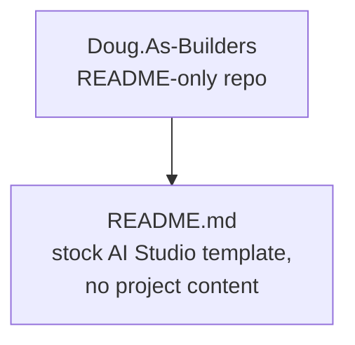

# Beexly / Doug.As-Builders

**AI wiki overview**

Thin repo — **the file tree contains exactly one file: `README.md`.** There is no code, no config, no other docs. The README is the stock Google AI Studio template (a banner image plus "Built with AI Studio — The fastest path from prompt to production with Gemini" and a link to aistudio.google.com/apps); it carries no project-specific description. Repo description is "NA", default branch `main`, last pushed 2026-09-25. Per the Beexly org conventions this appears to be a placeholder/scratch repo, not a project.

**Architecture (mermaid)**

**Star intel**

- Stars: **0** — flat, unstarred. Single-file README placeholder.
- Star history: https://star-history.com/#Beexly/Doug.As-Builders

**Power-trick links**

- https://github.dev/Beexly/Doug.As-Builders
- https://codewiki.google/github.com/Beexly/Doug.As-Builders
- https://gitdiagram.com/Beexly/Doug.As-Builders
