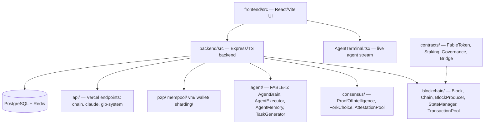

# Beexly/Fablechain

**Repo:** https://github.com/Beexly/Fablechain
**Description:** Fablechain — Autonomous AI-driven blockchain powered by FABLE-5
**Type:** Public FORK (upstream not captured; forked from the original FableChain project)
**Default branch:** `main` · **Last pushed:** 2026-08-12 · **Primary language:** TypeScript (~4.03M bytes; also Solidity, CSS, Python)
**Stars:** 0 · **Forks:** 0
**Star history:** https://star-history.com/#Beexly/Fablechain

## AI wiki overview

FableChain is an experiment in **autonomous LLM-driven blockchain development**: an agent called **FABLE-5** builds a complete blockchain from the ground up — writing TypeScript, running tests, and committing changes — while a live terminal streams its output on the web. Key design claims (from README): block production every 10 seconds, transaction pool + validation, Merkle-root state management, a native FABLE token, and persistent agent memory / self-directed goals.

### Architecture

- **`backend/src/`** — Node.js + Express + TypeScript backend. Sub-modules:
  - `blockchain/` — core chain: `Block.ts`, `BlockProducer.ts`, `Chain.ts`, `Consensus.ts`, `Crypto.ts`, `StateManager.ts`, `TransactionPool.ts`, `TransactionReceipt.ts`, `AIValidator.ts`
  - `consensus/` — `ProofOfIntelligence.ts`, `ForkChoice.ts`, `AttestationPool.ts`, `RoundTimer.ts`, `ValidatorRegistry.ts`
  - `agent/` — FABLE-5 itself: `AgentBrain.ts`, `AgentExecutor.ts`, `AgentMemory.ts`, `AgentGoals.ts`, `AgentWorker.ts`, `TaskGenerator.ts`, `TaskBacklog.ts`, `GitIntegration.ts`, `CIMonitor.ts`, `BrowserAutomation.ts`
  - Also: `ai/`, `api/`, `byzantine/`, `chain/`, `crypto/`, `database/`, `mempool/`, `p2p/`, `rpc/`, `sharding/`, `state/`, `validators/`, `vm/`, `wallet/`, `x402/`
  - `backend/dist/` — committed compiled JS output (build artifacts checked into the repo; ~most of the 3,566-tree file count is here)
- **`frontend/src/`** — React + Vite frontend: `AgentTerminal.tsx` (live FABLE-5 terminal), `BlockExplorer.tsx`, `Wallet.tsx`, `CIPSystem.tsx` / `CIPSubmit.tsx` (Fablechain Improvement Proposals), `LiveDebate.tsx`, `MultiAgentChat.tsx`, `AdminDashboard.tsx`, `Faucet.tsx`, wallet connectors (Phantom, MultiWallet)
- **`api/`** — Vercel-style serverless endpoints: `chain.ts`, `claude.ts`, `openai.ts`, `database.ts`, `admin.ts`, `chatlog.ts`, and GIP system (`gip-router.ts`, `gip-system.ts`, `gip-types.ts`)
- **`contracts/`** — Solidity: `FableToken.sol`, `FableStaking.sol`, `FableGovernance.sol`, `FableBridge.sol`, `FableOracle.sol`, `ORCTOKEN.sol`
- **`docs/`** — `ARCHITECTURE.md`, plus topic docs (consensus, mempool, rpc-api, staking, bridge, ai-layer)
- **`tests/`** — `unit/`, `ai/`, `consensus/`, `crypto/`, `mempool/`, `p2p/`, `rpc/`, `state/`
- **`scripts/fable_commit.py`** — commit helper; **`handoff/AUDIT_FINDINGS_20260812.md`** — an audit handoff note
- Infra: `Dockerfile`, `docker-compose.yml`, `railway.json`, `vercel.json`, `Procfile`, `deploy.sh`, `.github/workflows/fable-agent.yml` + `ci.yml`

Key files with pointers (seen in tree, not read for content):
`backend/src/blockchain/Chain.ts` · `backend/src/blockchain/BlockProducer.ts` · `backend/src/consensus/ProofOfIntelligence.ts` · `backend/src/agent/AgentBrain.ts` · `backend/src/agent/AgentMemory.ts` · `frontend/src/AgentTerminal.tsx` · `contracts/FableToken.sol` · `docs/ARCHITECTURE.md`

## Architecture diagram

## Star intel

**0 stars / 0 forks — flat.** No external traction on this fork. The interesting surface is the original upstream project (FableChain concept + X account @FableChain, and a Solana CA is listed in the README — `BucFPfoGNAeECbXaA6MxrvyZ2vaYXXaip3JtcY1Zpump`), not this repo copy.
**Star history:** https://star-history.com/#Beexly/Fablechain

## Power-trick links

- Web IDE: https://github.dev/Beexly/Fablechain
- AI wiki: https://codewiki.google/github.com/Beexly/Fablechain
- Diagram: https://gitdiagram.com/Beexly/Fablechain

## Notes / gaps

- README is present and informative (full quoted above); docs/ARCHITECTURE.md exists but was not fetched — it is the natural next read for the build plan.
- Verification limit: file tree + README only; no source files were opened, so the "what each module does" above comes from filenames + README claims, not verified behavior.
- Fork of an upstream FableChain repo — Beexly-specific changes vs upstream were not diffed.
