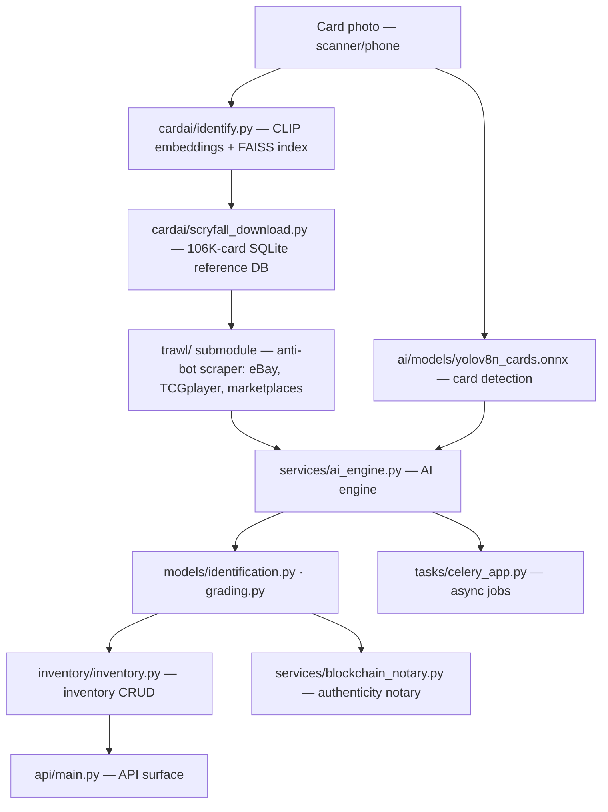

# Beexly/GSN.Cards

**Repo:** https://github.com/Beexly/GSN.Cards
**Description:** (none set)
**Type:** Public, NOT a fork (original repo)
**Default branch:** `main` · **Last pushed:** 2026-08-31 · **Primary language:** Python
**Stars:** 0 · **Forks:** 0
**Star history:** https://star-history.com/#Beexly/GSN.Cards

## AI wiki overview

GSN.Cards is a **full-stack trading-card identification engine**: card photo → CLIP/FAISS visual identification → structured card data → marketplace listings. Built on the **Card Dealer Pro** architecture: a scraping/anti-bot engine (Trawl) + CLIP-based visual search AI + a vocab-driven data-transformation pipeline that outputs to eBay/CollX-style marketplace schemas.

### Architecture

From the README pipeline diagram + tree:

- **`trawl/`** — git submodule → `germondai/trawl` — self-hosted scraping engine with anti-bot bypass (Cloudflare, Akamai, Imperva, CAPTCHAs); 4-tier escalation: plain HTTP → cached session → fresh browser solve → residential proxy. Live at :8191 API / :8192 proxy. Fetches pricing/data from eBay, TCGplayer, marketplaces.
- **`cardai/`** — `scryfall_download.py` (downloads Scryfall's 106K+ Magic card DB with metadata + image URLs into local SQLite) and `identify.py` (CLIP image embeddings + FAISS vector index; `identify <photo>` command). README notes `transform.go` in `cdp_export_tool/` (port of CDP's transformation pipeline) — that dir was NOT present in the `main` tree, so treat the export pipeline as either unwired or living elsewhere.
- **`ai/models/`** — committed model binaries: `vit_b16.onnx` (+.data), `yolov8n_cards.onnx` (+.data, card detection), `custom_lora.pt` (custom fine-tune)
- **`models/`** — domain models: `identification.py`, `grading.py`, `inventory.py`, `capture.py`, `change_log.py`, `base.py`
- **`api/main.py`** — the API surface; **`services/`** — `ai_engine.py`, `portfolio_agent.py`, `scanner_discovery.py`, `blockchain_notary.py` (authenticity notary); **`inventory/`** — inventory CRUD + tests; **`db/`** — `init_db.py`, `session.py`; **`tasks/celery_app.py`** — async job queue
- **`data/local_scans/`** — 12 sample card photos (Charizard 1st Ed, Lugia 1st Ed, Wembanyama Silver Prizm, Caitlin Clark Bowman Chrome rookie, Brock Purdy RPA, Elly De La Cruz, Bedard Young Guns, One Piece manga Luffy, Lorcana Elsa, Gengar 151 SIR) — the test/identification corpus, plus blurry/damaged edge-case samples
- **`adapters/digital_reverse.py`**, **`tests/`** (`validate_ebay_schema.py`, `test_api_and_security.py`), `docker-compose.yml`, `MASTER-ROUTING.md`, `RULES.md`, `GSN_DEPLOYMENT_STATUS.json`, `tool-index.json`, `diff.enc` (encrypted diff file — contents not readable)

Quick start (from README): `cd trawl && docker compose up -d` → `python cardai/scryfall_download.py` → `python cardai/identify.py build` → `python cardai/identify.py identify <card.jpg>`.

## Architecture diagram

## Star intel

**0 stars / 0 forks — flat.** It's a working-engine repo (marketplace/card-reseller tooling), not a star magnet; traction would show up in card sales, not GitHub stars.
**Star history:** https://star-history.com/#Beexly/GSN.Cards

## Power-trick links

- Web IDE: https://github.dev/Beexly/GSN.Cards
- AI wiki: https://codewiki.google/github.com/Beexly/GSN.Cards
- Diagram: https://gitdiagram.com/Beexly/GSN.Cards

## Notes / gaps

- README present and detailed (pipeline quoted above). The `cdp_export_tool/` dir referenced in the README was not found in the `main` tree — the export pipeline may live on another branch or be pending.
- `diff.enc` is an encrypted file; contents not readable.
- Verification limit: README + tree + `.gitmodules` only; no code files opened. `trawl` submodule contents were not inspected (external repo `germondai/trawl`).
