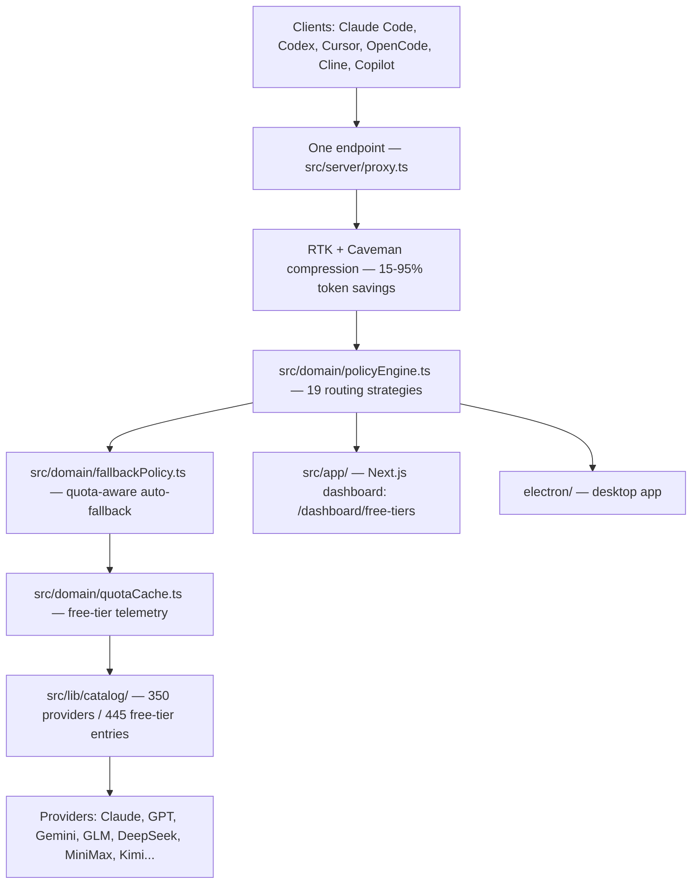

# Beexly/OmniRoute

**Repo:** https://github.com/Beexly/OmniRoute
**Description:** "Never stop coding. Free MIT AI gateway: one endpoint, 350 providers (90+ free), 1200+ models Kimi, Claude, GPT, Gemini, GLM, DeepSeek, MiniMax. Works with Claude Code, Codex, Cursor, OpenCode, Cline & Copilot. Quota-aware auto-fallback, RTK+Caveman compression saves 15-95% tokens, MCP/A2A, Desktop/PWA. Built by 450+ contributors"
**Type:** Public FORK of **diegosouzapw/OmniRoute** (upstream: ~72,305 stars)
**Default branch:** `release/v3.8.51` · **Last pushed:** 2026-09-18 · **Primary language:** TypeScript
**Stars:** 0 · **Forks:** 0
**Star history:** https://star-history.com/#Beexly/OmniRoute

## AI wiki overview

OmniRoute is a **free, MIT-licensed AI model gateway / router**: one OpenAI-compatible endpoint that fans out to ~350 providers (90+ free tiers, ~1.51B free tokens/month per the README's pool-deduped math), 1,200+ models (Claude, GPT, Gemini, GLM, DeepSeek, MiniMax, Kimi…). It plugs into coding agents (Claude Code, Codex, Cursor, OpenCode, Cline, Copilot) with quota-aware auto-fallback, RTK + "Caveman" stacked compression (15–95% token savings), 19 routing strategies, MCP/A2A support, and a desktop/PWA shell. This is Garrett's fork — his go-to model router per standing memory.

### Architecture (from tree, 15,328 entries)

- **`src/domain/`** — routing core: `policyEngine.ts`, `pipeline.ts`, `fallbackPolicy.ts`, `tagRouter.ts`, `quotaCache.ts`, `degradation.ts`, `lockoutPolicy.ts`, `modelAvailability.ts`, `costRules.ts`, `connectionModelRules.ts`, `persistence/`
- **`src/lib/`** — infra library: `catalog/` (provider catalog), `api/`, `auth/`, `cacheLayer.ts`, `a2a/`, `acp/`, `batches/`, `audit/`, plus CLI tooling (`cliTools`, `cli-helper`)
- **`src/server/`** — server stack: `proxy.ts`, `auth`, `authz`, `cors`, `origin`, `ws` (websocket), `mitm/`
- **`src/app/`** — Next.js dashboard UI (`(dashboard)`, `api/`, `auth/`, error pages, `/dashboard/free-tiers` budget view); **`src/models/`**, `src/hooks/`, `src/i18n/`, `src/store/`, `src/types/`, `src/sse/`
- **`@omniroute/`** — npm packages: `opencode-plugin`, `opencode-provider`; **`packages/browser-pool/`**
- **`electron/`** — desktop app (`main.js`, `preload.js`, `loginManager.js`) — Desktop/PWA lane
- **`docs/`** — heavy: `OMNIROUTE_ROUTING_POLICY.md`, `OMNIROUTE_PROVIDER_FAILOVER.md`, `OMNIROUTE_QUOTA_TELEMETRY.md`, `OMNIROUTE_ALLOCATION_HANDOFF.md`, `reference/FREE_TIERS.md`, `providers/`, `routing/`, `compression/`, `openapi.yaml`
- **`bin/`**, **`scripts/`**, **`contrib/`**, **`examples/`**, **`skills/`**, `Dockerfile(.bun)`, `docker-compose.yml`, `fly.toml` — packaging/deploy

Key files with pointers (seen in tree): `src/domain/policyEngine.ts` · `src/domain/pipeline.ts` · `src/domain/fallbackPolicy.ts` · `src/domain/quotaCache.ts` · `src/server/proxy.ts` · `docs/OMNIROUTE_ROUTING_POLICY.md` · `docs/reference/FREE_TIERS.md`

## Architecture diagram

## Star intel

**0 stars / 0 forks — flat** on this fork. The gravity is entirely upstream: diegosouzapw/OmniRoute at ~72.3k stars. Garrett's fork is a personal copy of his router, not a community play.
**Star history:** https://star-history.com/#Beexly/OmniRoute

## Power-trick links

- Web IDE: https://github.dev/Beexly/OmniRoute
- AI wiki: https://codewiki.google/github.com/Beexly/OmniRoute
- Diagram: https://gitdiagram.com/Beexly/OmniRoute

## Notes / gaps

- No Beexly-specific changes were identified from the tree + README pass; Beexly customization (if any) vs upstream was not diffed.
- Verification limit: repo metadata + README + recursive tree only; no source files opened.
