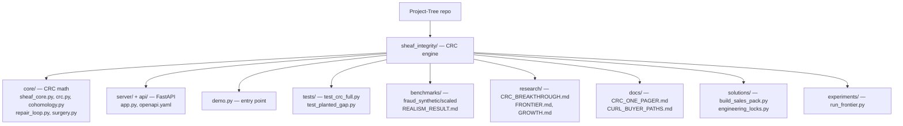

# Beexly/Project-Tree — AI Wiki Intel

**Repo:** https://github.com/Beexly/Project-Tree
**Description:** "N.a" (no meaningful description set)
**Default branch:** `main` · **Last push:** 2026-07-30 · **Language:** Python
**Created:** 2026-07-30 (small repo, ~86 KB; 1 open issue)

## AI Wiki Overview

Project-Tree is the standalone home for the **CRC knowledge-integrity wedge** (`sheaf_integrity`) — a classical multi-source consistency engine. Per the README, it is explicitly **not part of Beexly/Sports** until an explicit founder YES; the repo is the durable home for this line of work.

**What it is (from README):** a classical multi-source consistency engine that repairs data-consistency classes: `consistent` | `statistical` | `structural` | `self_consistent_wrong_vs_ledger`. Quick start: `pip install numpy fastapi uvicorn`, then `python demo.py` (or `python demo.py --serve` for the FastAPI server on :8080). Status per README: "Path A technically complete in sandbox. Some core modules may still be landing on main — check `sheaf_integrity/core/`."

**Architecture / main dirs** (all under `sheaf_integrity/`):
- `core/` — the CRC engine itself. Key files observed: `sheaf_core.py`, `crc.py`, `crc_part_a.py`, `crc_part_b.py`, `block_crc.py`, `cohomology.py`, `cycle_space.py`, `holonomy_cheeger.py`, `ingest_multisource.py`, `ledger_policy.py`, `product_modes.py`, `ranker_bakeoff.py`, `repair_loop.py`, `surgery.py`, `surgery_equivalence.py`
- `server/` — FastAPI surface (`server/app.py`, plus `api/openapi.yaml` for the OpenAPI spec)
- `demo.py` — top-level demo / entry point (repo root of the package)
- `tests/` — `test_crc_full.py`, `test_planted_gap.py`, `test_surgery_vs_fes.py`
- `benchmarks/` — `fraud_scaled.py`, `fraud_synthetic.py`, `multisystem_graph.json`, `REALISM_RESULT.md`, `realism_kyc_crm_ledger.json`, `public_schema_extract/`
- `experiments/` — `run_frontier.py`
- `research/` — research notes: `CRC_BREAKTHROUGH.md`, `FRONTIER.md`, `DEEP_FRONTIER.md`, `GROWTH.md`, `LEARNED_MAPS_DECISION.md`, `LEVERAGE_GATES.md`, `NONABELIAN_LEARNED_PARK.md`, `SURGERY_VS_FES.md`, `CRC_S_ABELIAN_NOTE.md`
- `docs/` — `CRC_ONE_PAGER.md`, `CONCRETE_SNIPPETS.md`, `CURL_BUYER_PATHS.md`, `NDA_EXTRACT_PROTOCOL.md`
- `solutions/` — `build_sales_pack.py`, `engineering_locks.py`, `robustness_tests.py`, `partial_sot_csv.py`, `COUSIN_FIELDS.md`, `NON_GOALS.md`, `openapi_examples.md`, `path_b_sameas_experiment.md`
- Root-level docs: `AGENT_HANDOFF.md`, `DECISIONS.md`, `IP_WEDGE.md`, `MANIFEST.json`, `STATUS.md`, `WHAT_THIS_IS.md`

## Architecture diagram

## Star intel

**Stars:** 0 — a private-to-owner working repo with no public stars.
**Star history:** https://star-history.com/#Beexly/Project-Tree

## Power-trick links

- VS Code in browser: https://github.dev/Beexly/Project-Tree
- AI code wiki: https://codewiki.google/github.com/Beexly/Project-Tree
- Diagram view: https://gitdiagram.com/Beexly/Project-Tree
