# Beexly/Sports — AI Wiki Intel

**Repo:** https://github.com/Beexly/Sports
**Description:** (none set in metadata; README title: "Galaxy Sports Edge (GSE)")
**Default branch:** `main` · **Last push:** 2026-10-02 · **Language:** TypeScript
**Created:** 2026-04-07 · **Size:** ~531 MB · **Open issues:** 191
**Homepage:** https://sports-web-nine.vercel.app

## AI Wiki Overview

Sports is the Galaxy Sports Edge system of record: a sports picks platform with real data ingestion, deterministic factor-model prediction ranking, subscription paywalls, content generation, and an internal operator cockpit. Tagline: "We're not AI. We're math you can read." **Not open source** — publicly viewable only, PolyForm Noncommercial License 1.0.0. Current mode per README: **internal calibration only** — no auto-publish, no auto-send, no external posting, no automated betting. Agents start at `AGENTS.md`; `CLAUDE.md` is the product overview.

**Architecture (from the main-branch tree — 13,542 entries, top 2 levels summarized):**

- `apps/web` — the web application (Next.js-style frontend; deployed at sports-web-nine.vercel.app)
- `packages/` — 20 workspace packages: `prediction-engine`, `ingestion-pipeline`, `data-ingestion`, `db`, `feature-store`, `epistemic-twin`, `genesis-kernel`, `ai-council`, `stats-api`, `compliance`, `crypto`, `dev-tools`, `governed`, `ops`, `partner-stack`, `phase-c`, `quote-plane`, `sql`, `types`, `util`
- `gse-ml-service/` — Python ML microservice (`app/`, `Dockerfile`, `requirements.txt`, tests)
- `data/` — `gse-dataset` (nflverse contracts/rosters/snap-count JSONLs + ingest manifest), `reasoning` (parts registry for stored reasoning traces), `backtest`, `beex-picks`, `nova`, `source-atlas`, `statking`
- `docs/` — 54+ entries: `INDEX.md`, `architecture.md`, `adr/`, `arxiv-program/`, `audit/`, `agents/`, `api/`, `business/`, `brain/`, and strategy docs (`BOOTSTRAP_LEVERAGE.md`, `PROPRIETARY_METRICS_REPRODUCTION_STRATEGY.md`, `FREE_FIRST_DATA.md`, ...)
- `scripts/` — 29 subdirs + many scripts: calibration (`calibrate-weights.py`, `calibrate-ol-drag.py`), backfill, backtest, db (`db-inventory.cjs`), deploy readiness checks, `agent-eval`, `compliance`
- `eval/` — `edge-lab`, `promptfoo` (model/eval harness)
- `formal/` — formal-methods area (`INDUCTION_DOCTRINE.md`, `abstract/`, `ai-invocation/`, `credit-budget/`, `receipts/`, ...)
- `handoff/` — large operator-handoff area (audits, launch blockers, sprint logs, session handoffs) — `00-READ-CANONICAL.md` is the entry
- `workers/` — background workers: `pick-generation`, `data-refresh`, `content-publishing`, `airwave-listener`
- `reports/` — test reports, audits, agent handoffs, launch-night, edge-lab reports
- `schemas/` — data schemas; `components/statking`, `lib/statking` — statking UI/data libs; `social/` — launch assets
- `infra/` + `infrastructure/` (aws), `docker/` — deployment infra
- `design-system/` + `design-preview/`, `brand-kit/` — brand/design assets
- `arxiv-deep/` — deep arxiv paper notes; `.grok/`, `.claude/`, `.hermes/`, `.agents/` — agent workspaces
- Root key files: `AGENTS.md`, `CLAUDE.md`, `START_HERE.md`, `QUICKSTART.md`, `neon.ts`, `vercel.json`, `package.json`, `playwright.config.ts`, `socket.yml`

**Note:** no `intelligence/` top-level directory was observed on `main` — intelligence work lives on feature branches. Per README, the reasoning layer currently runs `readParts` → `aggregateSignals` over stored parts in `data/reasoning/parts-registry.jsonl`; officials/weather/narrative/coaching lanes are DARK.

## Architecture diagram

```mermaid
graph TD
    R[Sports = Galaxy Sports Edge]
    R --> APP[apps/web — Next.js app<br/>sports-web-nine.vercel.app]
    R --> PKG[prediction-engine — deterministic<br/>factor-model ranking]
    R --> ING[ingestion-pipeline + data-ingestion<br/>nflverse, odds, injury feeds]
    R --> FS[feature-store + db + sql<br/>neon.ts — Neon Postgres]
    R --> MLS[gse-ml-service/ — Python ML service]
    R --> DATA[data/ — gse-dataset<br/>reasoning parts registry<br/>backtest, source-atlas]
    R --> WRK[workers/ — pick-generation<br/>data-refresh, content-publishing]
    R --> EVAL[eval/ — edge-lab, promptfoo<br/>formal/ — formal methods]
    R --> DOC[docs/ — architecture, adr<br/>arxiv-program, audits]
    R --> HAND[handoff/ — operator handoffs<br/>audits, launch blockers]
    R --> AG[AGENTS.md + CLAUDE.md<br/>START_HERE.md — agent entrypoints]
    R --> INFRA[infra/ + docker/ + infrastructure/<br/>vercel.json — Vercel deploy]
```

## Star intel

**Stars:** 0 — no public stars (internal system of record, not marketed).
**Star history:** https://star-history.com/#Beexly/Sports

## Power-trick links

- VS Code in browser: https://github.dev/Beexly/Sports
- AI code wiki: https://codewiki.google/github.com/Beexly/Sports
- Diagram view: https://gitdiagram.com/Beexly/Sports
