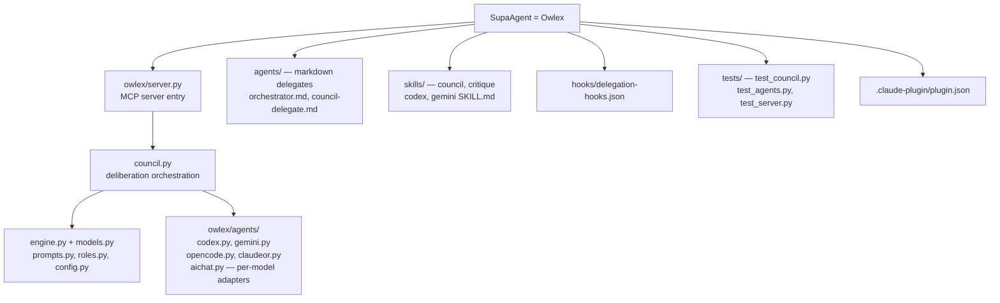

# Beexly/SupaAgent — AI Wiki Intel

**Repo:** https://github.com/Beexly/SupaAgent
**Description:** (none set — repo metadata description is null)
**Default branch:** `main` · **Last push:** 2026-03-15 · **Language:** Python
**Created:** 2026-05-24 · **Size:** ~9 MB

## AI Wiki Overview

SupaAgent is the Beexly-hosted home of **Owlex** — an MCP-compatible tool that gives "a second opinion without leaving Claude Code." Different AI models have different strengths and blind spots; Owlex lets you query Codex, Gemini, OpenCode, ClaudeOR, and AiChat directly from Claude Code, optionally running a structured deliberation ("council") where agents review each other's answers before Claude synthesizes a final response.

**How the Council works (from README):**
1. **Round 1** — the question goes to each agent independently; they answer without seeing each other.
2. **Round 2** — each agent sees all Round 1 answers and can revise its position.
3. **Synthesis** — Claude reviews everything and outputs a structured answer.

Use cases: architecture decisions, debugging tricky issues, or anything that matters more than a single model can confidently answer. Options include `deliberate` (Round 2 on by default), `critique` (agents critique instead of revise), `roles` (specialist perspectives: security, perf, skeptic, architect, maintainer, dx), `team` (presets), `timeout`. Install via `uv tool install git+https://github.com/agentic-mcp-tools/owlex.git`, registered in `.mcp.json` as an MCP server (`owlex-server`).

**Architecture / main dirs** (56 entries total, Python package `owlex`):
- `owlex/` — main package: `server.py` (MCP server entry), `council.py` (deliberation orchestration), `engine.py`, `models.py`, `prompts.py`, `roles.py`, `config.py`, `__init__.py`
- `owlex/agents/` — per-model agent adapters: `base.py`, `codex.py`, `gemini.py`, `opencode.py`, `claudeor.py`, `aichat.py`
- `agents/` — Claude Code delegate/agent definitions (markdown): `orchestrator.md`, `council-delegate.md`, `codex-delegate.md`, `gemini-delegate.md`
- `skills/` — skill definitions with READMEs: `skills/council/SKILL.md`, `skills/critique/SKILL.md`, `skills/codex/SKILL.md`, `skills/gemini/SKILL.md`
- `hooks/` — `delegation-hooks.json`
- `.claude-plugin/` — `plugin.json` (Claude Code plugin packaging)
- `tests/` — `test_council.py`, `test_agents.py`, `test_server.py`, `test_sessions.py`, `test_lifecycle.py`, `test_config.py`, `test_cleaners.py`, `conftest.py`
- `media/` — demo GIFs/MP4 + `gen_flow.py` (demo asset generator)
- `pyproject.toml`, `LICENSE` (MIT), `.gitignore`

## Architecture diagram

## Star intel

**Stars:** 0 — no public stars on the Beexly copy.
**Star history:** https://star-history.com/#Beexly/SupaAgent

## Power-trick links

- VS Code in browser: https://github.dev/Beexly/SupaAgent
- AI code wiki: https://codewiki.google/github.com/Beexly/SupaAgent
- Diagram view: https://gitdiagram.com/Beexly/SupaAgent
