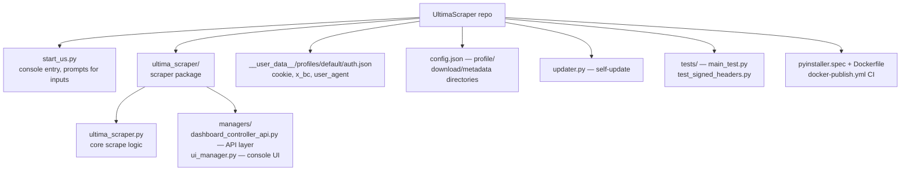

# Beexly/UltimaScraper — AI Wiki Intel

**Repo:** https://github.com/Beexly/UltimaScraper
**Description:** "Scrape all the media from an OnlyFans account - Updated regularly"
**Default branch:** `main` · **Last push:** 2026-07-29 · **Language:** Python 3.10.1+
**Created:** 2026-07-29 · **Size:** ~2.2 MB

## AI Wiki Overview

UltimaScraper is a Python CLI application for downloading media from an OnlyFans account (appears to be a Beexly copy/vendored version of the upstream open-source `ultima_scraper` project by 0xHoarder). Per the README: auth requires extracting `cookie`, `x_bc`, and `user_agent` values from a logged-in OnlyFans session via the browser network debugger and placing them in `__user_data__/profiles/default/auth.json`. Run with `poetry run python start_us.py` (Poetry-based install; a self-updater is provided via `updater.py`). Config (`config.json`) controls profile, download, and metadata directories with multi-drive rollover for downloads.

Known broken items noted in the README (from the upstream text): profile and header images not downloading; UI download progress bars.

**Architecture / main dirs** (34 entries total, small repo):
- `start_us.py` — console entry point (prompts for inputs)
- `ultima_scraper.py` (package: `ultima_scraper/`) — main scraper logic (`ultima_scraper.py`)
- `ultima_scraper/managers/` — `dashboard_controller_api.py` (API interaction layer), `ui_manager.py` (console UI)
- `ultima_scraper/docs/` — docs assets (img/)
- `updater.py` — self-update script
- `tests/` — `main_test.py`, `test_signed_headers.py`
- `pyproject.toml` + `poetry.lock` — Poetry dependency management; `pyinstaller.spec` — binary build spec; `Dockerfile` + `.dockerignore` — container build; `.github/workflows/docker-publish.yml` — Docker publish CI
- `LICENSE`, `README.md`, `.gitignore`, `.gitattributes`

## Architecture diagram

## Star intel

**Stars:** 0 — no public stars.
**Star history:** https://star-history.com/#Beexly/UltimaScraper

## Power-trick links

- VS Code in browser: https://github.dev/Beexly/UltimaScraper
- AI code wiki: https://codewiki.google/github.com/Beexly/UltimaScraper
- Diagram view: https://gitdiagram.com/Beexly/UltimaScraper
