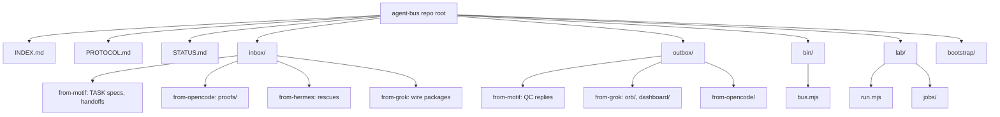

# Beexly/agent-bus — AI Wiki Intel

## Overview

**agent-bus** is the message bus for Garrett's AI agent team — Motif (strategy/QC) and the coding agent (build) pass tasks, results, proofs, and status through this repo so neither agent needs a human courier. Public repo, created 2026-09-10, pushed to as recently as 2026-10-02 (active daily).

**No README exists at repo root** (the `/repos/Beexly/agent-bus/readme` endpoint returns 404). Root-level docs are `INDEX.md`, `PROTOCOL.md`, and `STATUS.md`.

## Architecture

The repo is organized as a mail-queue filesystem:

| Directory | Role (from file tree) |
|---|---|
| `inbox/` | Per-agent intake folders: `from-builder/`, `from-grok/`, `from-gse-agent-2026-10-02/`, `from-hermes/`, `from-motif/`, `from-opencode/` |
| `outbox/` | Per-agent replies: `from-grok/`, `from-motif/`, `from-opencode/` |
| `bin/` | `bus.mjs` + `README.md` — the queue runner/tooling |
| `lab/` | `run.mjs` + `jobs/nflverse-reproduce.json` — experiment-runner scratch (ML-lab style jobs) |
| `bootstrap/` | `opencode-bootstrap.md` — agent onboarding prompt |

- `inbox/from-motif/` is the heavy lane: task specs (`TASK-001` through `TASK-016`, plus consolidated `TASK-016-v3-CONSOLIDATED-MISSION-2026-10-02.md`), build bibles, QC doctrines (`QUALITY-DOCTRINE.md`), and dated handoffs/specs.
- `inbox/from-opencode/proofs/` holds per-task proof files (builder QC evidence, e.g. `TASK-001-kit-lead-finder-proof.md`).
- `outbox/from-grok/` holds Grok's signal-desk work: `orb/` package (strategy, risk gate, ledger, alpaca adapter), `dashboard/index.html`, `desk_runner.py`, daily `cards/`.
- `PROTOCOL.md` (repo root) is the agent-handshake contract; `INDEX.md` is the bus index; `STATUS.md` tracks bus status.
- File:line pointers beyond the above were not read (task scope was tree-level; no file contents fetched).

## Mermaid architecture

## Star intel

- **Stars: 0** — flat. Internal ops repo, no public stars (expected).
- History: https://star-history.com/#Beexly/agent-bus

## Power-trick links

- VS Code web: https://github.dev/Beexly/agent-bus
- Code wiki: https://codewiki.google/github.com/Beexly/agent-bus
- Diagrams: https://gitdiagram.com/Beexly/agent-bus

---

*Generated 2026-10-02 by repo-intel worker (read-only GitHub API). Facts verified: repo metadata + full git tree (376 blobs, not truncated). README confirmed absent (404). File contents not read — descriptions of inbox/outbox lanes are from filenames only.*
