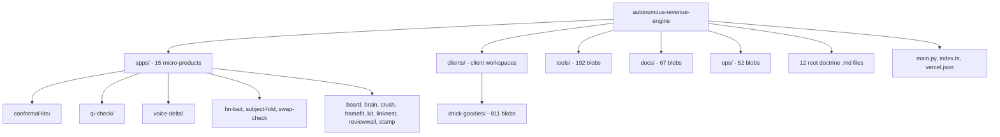

# Beexly/autonomous-revenue-engine — AI Wiki Intel

## Overview

**autonomous-revenue-engine** is the flagship autonomous-money machine: "Fully autonomous AI-driven revenue project (2026). Vertical agent kits, multi-agent workflows, and non-mainstream digital products. Managed by Grok." Public repo, created 2026-era, pushed 2026-10-02 (active today). **1 star.**

README.md exists but is minimal (356 bytes; I did not read its text).

## Architecture

1,221 blobs, not truncated. Top-level shape:

| Directory | Blobs | Role (from file tree) |
|---|---|---|
| `apps/` | 62 | 15 standalone product micro-apps |
| `clients/` | 812 | Client workspaces — currently only `chick-goodies/` (811 blobs) |
| `tools/` | 192 | Shared tooling |
| `docs/` | 67 | Documentation (partially visible) |
| `ops/` | 52 | Operations/supporting material |
| `kit-pack/` | 3 | Kit product packaging |
| `research/` | 2 | Research notes |
| `scripts/` | 2 | Helper scripts |
| `supabase/` | 3 | Supabase backend config |
| root `.md` docs | ~12 | Doctrine files: `ADVERSARIAL.md`, `ALGORITHMS.md`, `CONTEXT_AND_SCORING.md`, `HANDOFF.md`, `LEVERAGE.md`, `OPERATING.md`, `ORGANIZATION.md`, `ORIGINALITY.md`, `PLATFORM.md`, `RESEARCH_LOG.md`, `SECURITY.md`, `SIGN_SYSTEM.md` |
| root code | 5 | `main.py`, `index.ts`, `vercel.json`, `generate_charcuterie_video.py`, `generate_extra_videos.py`, `generate_stages.py` |

**`apps/` — the 15 micro-products** (each a self-contained tool with README):
- `conformal-lite/` (13 blobs) — Python conformal-prediction toolkit: `core.py`, `cqr.py`, `adaptive_cp.py`, `saocp.py`, `evalue.py`, `meter.py`, `lago.py`, `capi.py`, `__main__.py`, tests
- `qi-check/` (10 blobs) — Next.js scoring app: `app/api/score/route.js`, `lib/score.js`, `lib/eip3009.js`, tests
- `voice-delta/` (7 blobs) — JS CLI for voice/style diffing (`lib/delta.js`)
- `hn-bait/` (5), `subject-fold/` (5), `swap-check/` (5) — JS CLIs with `lib/*.js` + `lib/*.test.js` + package.json each
- `adaptive-cp/`, `board/`, `brain/`, `crush/`, `framefit/`, `kit/`, `linknest/`, `reviewwall/`, `stamp/` — mostly `index.html` + README (front-end micro-tools)

**`clients/chick-goodies/`** — the $1,500 Charcuterie Chick client engagement: proposals (`docs/proposal/Charcuterie-Chick-Proposal.html/.pdf`), imaging-sprint assets, research (`docs/research/emp-noma/`, `gathering/`), branding/spec markdown (`BIBLE.md`, `BRIEF.md`, `PROPOSAL.md`, `QUOTE.md`, `AUDIT.md`, `CLIENT-HANDOFF-INVOICE.md`, etc.), plus image assets.

No file contents read beyond README metadata; role descriptions above are filename-based.

## Mermaid architecture

## Star intel

- **Stars: 1** — essentially flat.
- History: https://star-history.com/#Beexly/autonomous-revenue-engine

## Power-trick links

- VS Code web: https://github.dev/Beexly/autonomous-revenue-engine
- Code wiki: https://codewiki.google/github.com/Beexly/autonomous-revenue-engine
- Diagrams: https://gitdiagram.com/Beexly/autonomous-revenue-engine

---

*Generated 2026-10-02 by repo-intel worker (read-only GitHub API). Facts verified: repo metadata + full git tree (1,221 blobs, not truncated). README present (356 bytes, contents not read). File contents not read — module roles are from filenames only.*
