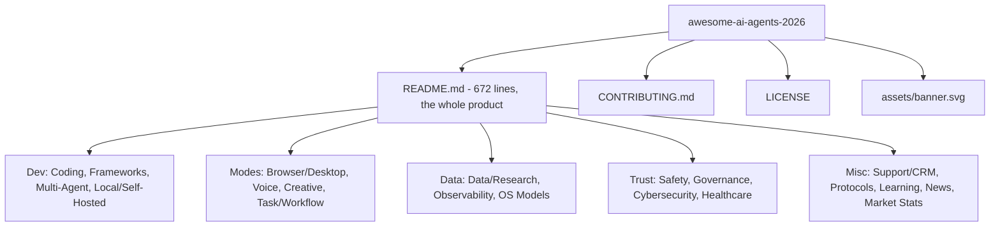

# Beexly/awesome-ai-agents-2026 — AI Wiki Intel

## Overview

**awesome-ai-agents-2026** is a curated "awesome list" of AI agents, frameworks, and tools for 2026 — "300+ resources · 20+ categories · Updated monthly." **0 stars.** Note: description says "updated monthly," but the repo was **last pushed 2026-04-02** (~6 months stale), so the "monthly" cadence has lapsed.

## Architecture

Extremely thin tree — 6 entries total, not truncated. No code; it's a single-document repo:

| File | Role |
|---|---|
| `README.md` | The entire product: 672 lines, ~46KB of categorized resource links |
| `CONTRIBUTING.md` | Contribution guidelines for PRs to the list |
| `LICENSE` | License |
| `assets/banner.svg` | README banner art |
| `.gitignore` | Standard ignore |

The README is the substance. Its 20 categories (verified from headings, not full text read):
1. Coding Agents
2. Agent Frameworks
3. Browser and Desktop Agents
4. Voice Agents
5. Creative AI
6. Task and Workflow Agents
7. Customer Support and CRM Agents
8. Data and Research Agents
9. Local and Self-Hosted AI
10. Multi-Agent Platforms
11. Protocols and Standards
12. Observability and Evaluation
13. Open-Source Models for Agents
14. AI Safety and Guardrails
15. AI Governance and Compliance
16. Cybersecurity Agents
17. Healthcare and Therapy Agents
18. Learning Resources
19. Newsletters and Communities
20. Market Stats 2026
(+ an "XVARY Stock Research" section)

No individual link entries were read — only category headings.

## Mermaid architecture

## Star intel

- **Stars: 0** — flat. Last push 2026-04-02; the "updated monthly" claim in the description is stale.
- History: https://star-history.com/#Beexly/awesome-ai-agents-2026

## Power-trick links

- VS Code web: https://github.dev/Beexly/awesome-ai-agents-2026
- Code wiki: https://codewiki.google/github.com/Beexly/awesome-ai-agents-2026
- Diagrams: https://gitdiagram.com/Beexly/awesome-ai-agents-2026

---

*Generated 2026-10-02 by repo-intel worker (read-only GitHub API). Facts verified: repo metadata + full git tree (6 entries, not truncated) + README section headings. Individual resource links in the README were not read.*
