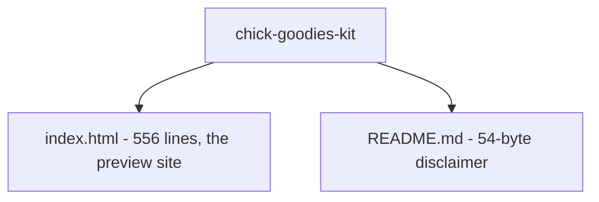

# Beexly/chick-goodies-kit — AI Wiki Intel

## Overview

**chick-goodies-kit** is a Kit ($350 one-page website) preview mockup for The Chick Goodies (Tomball) — a sample site, explicitly "Not the live shop." Public repo, created 2026-09-16, last pushed the same day (2026-09-16T01:07:52Z) — **dormant since creation, ~2.5 weeks stale.** **0 stars.**

README.md is 54 bytes, full text: "Kit preview for The Chick Goodies. Not the live shop."

## Architecture

The entire repo is **2 files** — nothing else to say architecturally:

| File | Role |
|---|---|
| `index.html` | The whole product: 556 lines (~25.9KB), title "The Chick Goodies — Tomball · Kit preview". Single-file static landing page (contents not read beyond title/size) |
| `README.md` | 54-byte disclaimer: "Kit preview for The Chick Goodies. Not the live shop." |

No build tooling, no dependencies, no subdirectories, no other assets.

## Mermaid architecture

## Star intel

- **Stars: 0** — flat. Single-purpose preview mockup, dormant since 2026-09-16.
- History: https://star-history.com/#Beexly/chick-goodies-kit

## Power-trick links

- VS Code web: https://github.dev/Beexly/chick-goodies-kit
- Code wiki: https://codewiki.google/github.com/Beexly/chick-goodies-kit
- Diagrams: https://gitdiagram.com/Beexly/chick-goodies-kit

---

*Generated 2026-10-02 by repo-intel worker (read-only GitHub API). Facts verified: repo metadata + full git tree (2 entries, not truncated) + README full text + index.html title/size. Page body contents not read.*
