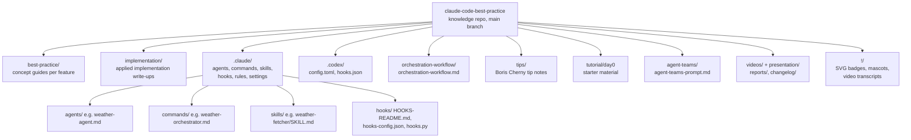

# Beexly / claude-code-best-practice

**AI wiki overview**

A knowledge repo on Claude Code best practices — "from vibe coding to agentic engineering," description "practice made claude perfect." It is a fork/remix of the upstream `shanraisshan/claude-code-best-practice` (README star badge points at that upstream; this Beexly copy has 0 stars). Pure documentation/configuration — no application code of its own.

- `best-practice/` — concept guides, one per Claude Code feature: `claude-subagents.md`, `claude-commands.md`, `claude-skills.md`, `claude-mcp.md`, `claude-memory.md`, `claude-settings.md`, `claude-cli-startup-flags.md`, `claude-power-ups.md`.
- `implementation/` — applied write-ups pairing each concept: `claude-subagents-implementation.md`, `claude-commands-implementation.md`, `claude-skills-implementation.md`, `claude-scheduled-tasks-implementation.md`, `claude-agent-teams-implementation.md`.
- `.claude/` — working config assets: `agents/` (e.g. `weather-agent.md`, `time-agent.md`, `presentation-curator.md`), `commands/` (e.g. `weather-orchestrator.md`, `time-command.md`), `skills/` (e.g. `weather-fetcher/SKILL.md`, `time-skill/SKILL.md`, `agent-browser/SKILL.md`), `hooks/` (`HOOKS-README.md`, `config/hooks-config.json`, `scripts/hooks.py`, sound assets), `rules/` (`markdown-docs.md`, `presentation.md`), `settings.json`, plus `agent-memory/` (e.g. `agent-memory/weather-agent/MEMORY.md`).
- `.codex/` — Codex parity config: `config.toml`, `hooks.json`, `hooks/`.
- `orchestration-workflow/` — `orchestration-workflow.md` + diagram assets (`orchestration-workflow.gif`/`.svg`), `output.md`, `weather.svg`.
- `tips/` — Boris Cherny tips notes (e.g. `claude-boris-15-tips-30-mar-26.md`, `claude-boris-2-tips-25-mar-26.md`, `claude-thariq-tips-17-mar-26.md`).
- `tutorial/` — `day0/` starter material. `agent-teams/` — `agent-teams-prompt.md` + `output/`. `videos/`, `presentation/`, `reports/`, `changelog/`, `development-workflows/` — media and supporting docs.
- Root: `README.md` (badge-linked concept table mapping subagents/commands/skills to their best-practice + implementation docs), `CLAUDE.md`, `.mcp.json`, `LICENSE`, `!/` (SVG badges, mascots, video transcripts).

No file:line pointers — all file names come from the API file tree; no file contents were read beyond the README.

**Architecture (mermaid)**

**Star intel**

- Stars: **0** — flat. This is an unstarred fork-copy of an upstream that itself trended (#1 GitHub trending repo of the day per README badge).
- Star history: https://star-history.com/#Beexly/claude-code-best-practice

**Power-trick links**

- https://github.dev/Beexly/claude-code-best-practice
- https://codewiki.google/github.com/Beexly/claude-code-best-practice
- https://gitdiagram.com/Beexly/claude-code-best-practice
