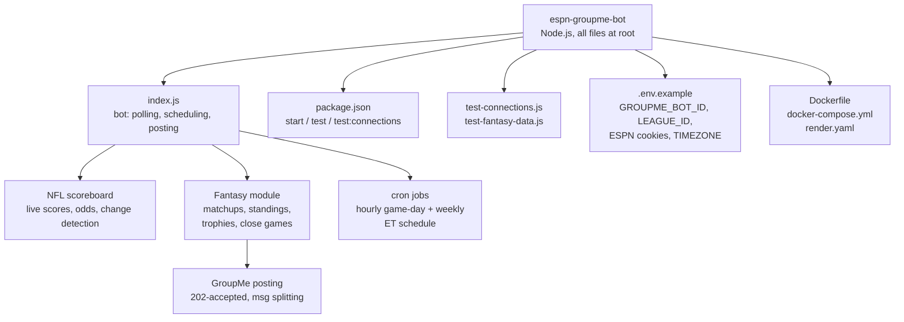

# Beexly / espn-groupme-bot

**AI wiki overview**

A single-directory Node.js bot: "A complete ESPN NFL + Fantasy Football bot for GroupMe with automated triggers, built from best practices in the dtcarls/fantasy_football_chat_bot reference implementation." All 11 files sit at the repo root — no subdirectories. Default branch `master`, last pushed 2026-09-01.

- `index.js` — the bot itself (entry point; per README it handles ESPN scoreboard polling, fantasy matchups/standings/trophies, cron scheduling, GroupMe posting with message splitting).
- `package.json` / `package-lock.json` — Node deps/scripts (`npm start`, `npm test`, `npm run test:connections`).
- `test-connections.js` — connection smoke test. `test-fantasy-data.js` — fantasy-data fetch test.
- `Dockerfile`, `docker-compose.yml`, `render.yaml` — deployment targets: Docker + Render + Railway (per README).
- `.env.example` — config template: `GROUPME_BOT_ID`, `LEAGUE_ID` (default 367989), `LEAGUE_YEAR`, `ESPN_SWID`/`ESPN_S2` cookies for private leagues, `TIMEZONE` (America/New_York), `SEASON_START`/`SEASON_END`, `ENABLE_*` and `CRON_*` toggles.
- `README.md` — detailed feature spec: NFL scoreboard (live scores/odds/status, change-detection, hourly on game days), fantasy module (matchups, scoreboard+projections, standings W-L-T/PF/PA/streak, "Trophies of the Week", close-games monitor ≤15.99 pts projected diff, waiver-wire summary, weekly recap), cron schedule table (scoreboard Mon/Fri 7:30am ET, matchups Thu 7:30pm, trophies Tue 7:30am, standings Wed 7:30am, recap Tue 9:30am, close-scores Mon 6:30pm), off-season gating, message splitting over GroupMe's 1000-char limit, health-check endpoint.

No file:line pointers — all file names come from the API file tree; no file contents were read beyond the README (module internals described from README only, not from index.js source).

**Architecture (mermaid)**

**Star intel**

- Stars: **0** — flat, unstarred.
- Star history: https://star-history.com/#Beexly/espn-groupme-bot

**Power-trick links**

- https://github.dev/Beexly/espn-groupme-bot
- https://codewiki.google/github.com/Beexly/espn-groupme-bot
- https://gitdiagram.com/Beexly/espn-groupme-bot
