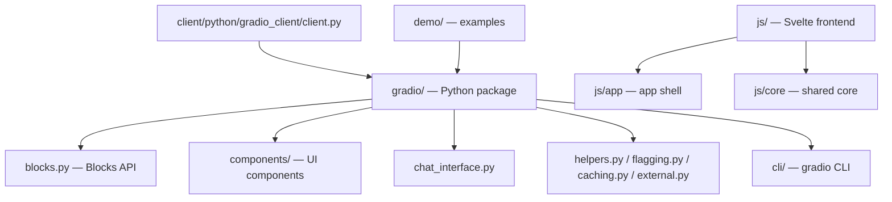

# Beexly/gradio-GSN

**Repo:** https://github.com/Beexly/gradio-GSN
**Description:** "Build and share delightful machine learning apps, all in Python. 🌟 Star to support our work!" (upstream Gradio tagline)
**Type:** Public FORK of **gradio-app/gradio** (upstream: ~43,652 stars)
**Default branch:** `main` · **Last pushed:** 2026-09-09 · **Primary language:** (none reported — GitHub language detection returned empty, consistent with a fresh fork)
**Stars:** 0 · **Forks:** 0
**Star history:** https://star-history.com/#Beexly/gradio-GSN

## AI wiki overview

gradio-GSN is a Beexly fork of the Gradio monorepo — the open-source Python library for building ML web apps/demos in a few lines of Python (upstream gradio-app/gradio). The tree (4,007 entries) matches the standard upstream layout; no Beexly-specific modifications were identified at the tree level (the purpose of the fork in the GSN stack is not documented in this repo — "GSN" likely = Galaxy Sports Network, i.e. a copy kept handy for building demo/UIs for the sports ML models).

### Architecture (upstream Gradio layout, from tree)

- **`gradio/`** — the Python package: `blocks.py` (core Blocks API), `components/` (all UI components), `chat_interface.py`, `interface.py` (not listed in first 30 but standard), `helpers.py`, `flagging.py`, `caching.py`, `external.py`, `analytics.py`, `cli/`, `http_server.py`, `_simple_templates/`, `i18n.py`
- **`client/python/gradio_client/`** — the Python client: `client.py`, `utils.py`, `data_classes.py`, `snippet.py`
- **`js/`** — Svelte frontend monorepo: `app/`, `core/`, plus one package per component (`chatbot`, `audio`, `dataframe`, `dropdown`, `button`, …)
- **`demo/`**, **`guides/`**, **`readme_files/`**, **`test/`**, **`scripts/`** — examples, docs, tests, release tooling
- **`.changeset/`** — versioned changelog workflow (changesets)
- Root config: `pyproject.toml`, `pnpm-workspace.yaml`, `package.json`, `svelte.config.js`

README is the standard upstream Gradio README (build ML web apps in Python, pip install gradio, Python 3.10+). Key upstream entry files (seen in tree): `gradio/blocks.py` · `gradio/components/` · `client/python/gradio_client/client.py`.

## Architecture diagram

## Star intel

**0 stars / 0 forks — flat** on this fork. The real gravity is upstream: gradio-app/gradio at ~43.6k stars. Forking was presumably for GSN demo-UI work, not community traction.
**Star history:** https://star-history.com/#Beexly/gradio-GSN

## Power-trick links

- Web IDE: https://github.dev/Beexly/gradio-GSN
- AI wiki: https://codewiki.google/github.com/Beexly/gradio-GSN
- Diagram: https://gitdiagram.com/Beexly/gradio-GSN

## Notes / gaps

- No Beexly-specific changes were identified from the read-only tree + README pass; a full diff against upstream was not run (read-only task scope, and rate-limit budget). If you need "what did Beexly change," compare `main` against `gradio-app/gradio` upstream tags.
- The "GSN" suffix purpose (Galaxy Sports Network demo tooling?) is inferred, not stated anywhere in the repo.
