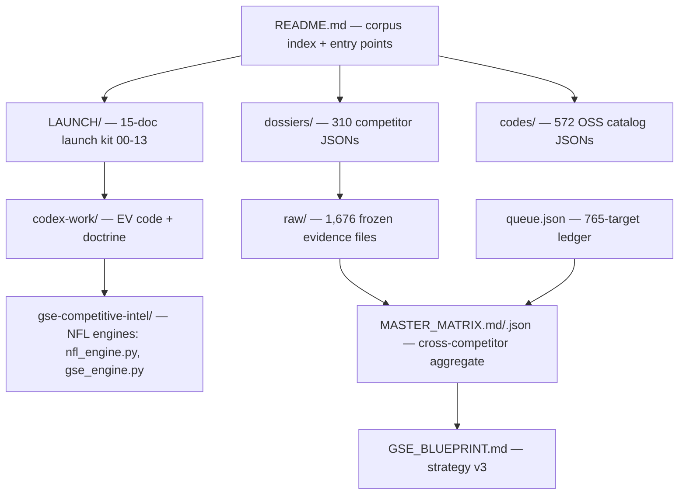

# Beexly/gse-competitive-intel

**Repo:** https://github.com/Beexly/gse-competitive-intel
**Description:** GSE competitive-intel corpus: 310 dossiers, 1,670 raw evidence files, 572 OSS code catalogs, MASTER_MATRIX, and the 2026-09-08 LAUNCH kit (copy decks, methodology, SEO, agent surface, prod audit of galaxysportsedge.com)
**Type:** Public, NOT a fork (original intel repo)
**Default branch:** `main` · **Last pushed:** 2026-09-28 · **Primary language:** HTML (corpus of harvested web artifacts)
**Stars:** 0 · **Forks:** 0
**Star history:** https://star-history.com/#Beexly/gse-competitive-intel

## AI wiki overview

This is Galaxy Sports Edge's **competitive-intelligence corpus** — the research brain behind the GSE launch. Three layers:

1. **Intel corpus (August 2026 wave):** 310 competitor dossiers (`dossiers/<domain>.json`, schema-defined, 247 live / 8 dead / 55 walled per README), 1,676 raw evidence files in `raw/` (HTTP captures, sitemaps, JS bundles, audit dumps — append-only), 572 OSS repo catalogs in `codes/` (algorithm + license noted), aggregated in `MASTER_MATRIX.md`/`.json`, strategy in `GSE_BLUEPRINT.md`, gap analysis in `PHASE4_GAPS.md`, and a fully-accounted 765-target queue in `queue.json`. The repo root is deliberately FLAT: hundreds of harvested pages (e.g. `fantasypros-*.md`, `scores24-*.md`, `s24-*.xml`, `fp-*.md`) sit at top level as frozen evidence.
2. **2026-09-08 LAUNCH kit** (`LAUNCH/`, 15 docs `00`–`13`): start at `LAUNCH/12-NEXT-AGENT-HANDOFF.md` → `LAUNCH/11-LAUNCH-NIGHT-RUNBOOK.md`; includes copy deck (`01`), methodology (`02`), engine constants (`03`), metrics canon (`04`), data-source stack (`05`), LLM/agent surface (`06`), SEO (`08`), record audit (`10`), plus `ENGINES-MATH-CALIBRATIONS-RESEARCH.md` and `13-P0-CLOSURE-VERIFICATION-2026-09-28.md`.
3. **Engines & curated code:** `gse-competitive-intel/fantasyguru/` + `fantasypros/` — runnable NFL engines (`nfl_engine.py`, `nfl_scheme_defense.py`, `gse_engine.py`), precomputed NFL feature CSVs, SMASH/BURR/Solds methodology; `codex-work/` — curated secret-free Codex EV code (`prediction-engine-reference/kelly.ts`, `poisson.ts`, `scoring.ts`, `evidence-readiness-matrix.ts`) + handoff docs + Sports-OS doctrine.

Rules (inherited): never fabricate (cite `raw/` or URL; else `NOT CONFIRMED`); `raw/` is append-only; child-agent outputs are claims until verified; product code lives in `Beexly/Sports` — this repo is intel only. PII-scrubbed.

Key files with pointers (seen in tree, README quoted): `LAUNCH/12-NEXT-AGENT-HANDOFF.md` · `LAUNCH/10-RECORD-AUDIT.md` · `MASTER_MATRIX.md` · `queue.json` · `PROTOCOL.md` · `codex-work/prediction-engine-reference/kelly.ts` · `gse-competitive-intel/fantasyguru/nfl_engine.py`

## Architecture diagram

## Star intel

**0 stars / 0 forks — flat.** It's a private-intel-style corpus (mostly harvested artifacts and internal docs), so zero public traction is expected; value is internal to GSE, not social.
**Star history:** https://star-history.com/#Beexly/gse-competitive-intel

## Power-trick links

- Web IDE: https://github.dev/Beexly/gse-competitive-intel
- AI wiki: https://codewiki.google/github.com/Beexly/gse-competitive-intel
- Diagram: https://gitdiagram.com/Beexly/gse-competitive-intel

## Notes / gaps

- README is rich and quoted above; repo convention is "root = corpus, everything flat" — do not mistake the 200+ root files for clutter, they're evidence.
- Verification limit: tree + README only; dossier JSON contents and engine code not opened.
